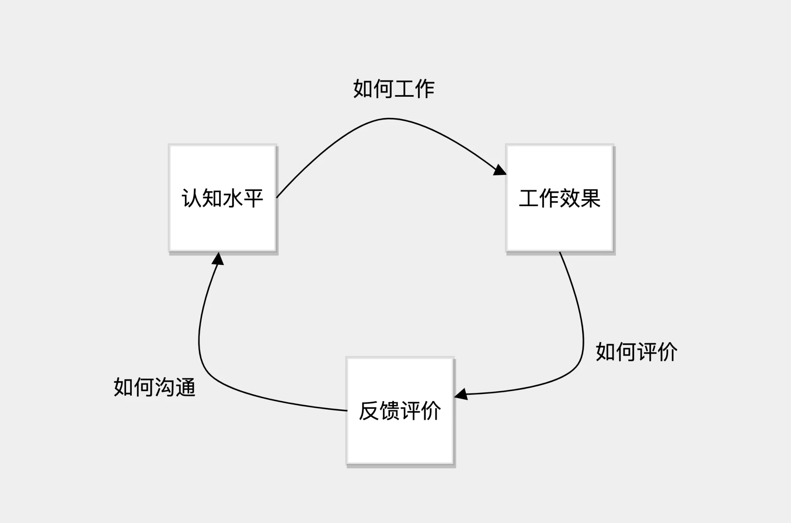
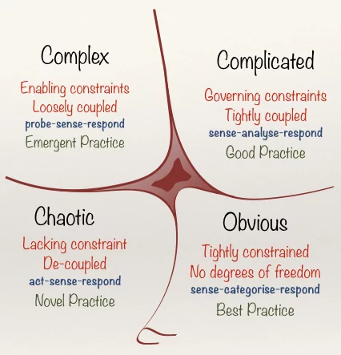

# 如何帮助新人快速融入团队

最近和一个同事聊起如何帮助刚进入公司的新同学顺利的通过试用期，在ThoughtWorks，这是我们一直关注的话题。从业十几年，加入ThoughtWorks之前的经验告诉我，入职后大概都是可以转正的，而在ThoughtWorks，这种认知被打破。新同学加入公司，无法快速适应团队文化，和其他同事的协作也不顺畅，虽然很卖力，但反馈并不好，最后只好无奈地离开。然而，这并不能说明这个同学能力有问题，至多是TA没办法适应当前的环境。

我倾向于相信经过我们严格的面试流程进来的大多数同学都是相对优秀的，是能够胜任当前团队工作的（这里不考虑能力不足的场景），那么上面提到的结果可以简单分为两种情况：

- 第一种是文化价值观不匹配，新同学以往的经历积累了很多经验，有自己的见解，进入新环境，仍然会比较坚持自己一贯的做法，某些场景下会产生理解上的冲突，虽然自我感觉已经做的很好了，但大家的反馈还是偏负面，最后评价一句”什么狗屁公司“，潇洒或无奈地离去。
- 另一种是很难找对发力点，新同学面对挑战和改变的心态是很开放的，积极主动摸索如何才能展示自己的真实实力，但终不得法。得到的反馈经常是态度非常积极，就是做事情的结果很难达到预期。

以上两种情况都有一个根本的原因，就是新同学对新环境的认知水平很低，很难理解在新环境下如何工作才能获得好的反馈。适应新团队的过程就是将个人认知水平提升至和团队整体认知一致的过程。

那么如何才能加速新同学认知水平的提升，尽快帮助TA融入新团队呢？答案就是让上面的认知反馈环转起来，优化其中的各个环节，建立起一个正向的增强回路。这就要求在新同学加入团队后，团队要给与足够的重视和帮助，把这个认知反馈环转起来。

### 如何帮助新同学理解和胜任团队的工作？

认知水平决定了工作方式，对于新同学而言，首先要对团队日常的工作有清晰的认知。基于[Cynefin框架](https://en.wikipedia.org/wiki/Cynefin_framework)，为了保持团队的高效能工作，团队成员对日常大部分工作应该处于Complicated或Obvious的认知水平。基于在Complicated和Obvious认知水平下工作的处理方式，可以推导出新同学首先需要理解的内容：

- 对于团队认知处在Obvious的工作，团队已经有了最佳实践，有固定的规则。因此，要帮助新同学了解当前团队的一些最佳实践，并理解起背后的含义，按章办事。
- 对于团队认知处在Complicated的工作，需要进行分析才能知道如何进行下一步，对于这些工作需要具备特定的技能。因此，可以针对这些技能给新同学进行培训或辅导，逐渐帮助TA成为专家，可以胜任这部分工作。

### 如何公正的评价新同学的表现？

新同学加入团队之初，TA的每一项工作都应该被关注，通过TA在工作中表现出来的能力来识别TA在认知水平上的不足。ThoughtWorks会为每一个新人安排一个Buddy，每周甚至每日进行必要的沟通以保证新同学能够快速的获得帮助，以至少1个月1次的频率来收集团队其他成员对新同学的反馈，并将这些反馈传达给新同学，和新同学一起来制定优化的措施。

我们强调基于事实的反馈，然而即便是基于事实，不可避免的也会掺杂有一些主观的因素。收集反馈的过程是把新同学的行为事实进行归类，识别哪些是好的可接受的，加以鼓励，哪些是不好的需要改进的，给出建议，这里不同的人看问题角度不同，得出的结论也会有差异。

那如何尽可能的做到公正的反馈评价呢：

- 关注过程中的表现，而不是“不管黑猫白猫，捉到老鼠就是好猫”。一味的结果导向很容易产生误导，给新同学错误的指向性信号。
- 关注行为背后展现出来的能力，而不只关注态度。态度积极很容易做到，特别是在试用期期间，但是否不断在提升自己以满足当前工作的需要才是更重要的。
- 关注基础工作的完成情况，不放大产生的问题。大多数人对损失和获得的敏感程度不对称，面对损失的痛苦感要大大超过面对获得的快乐感。正常的稳定输出并不一定会引起注意，而犯错一定让大家印象深刻，因此要杜绝这种心理带来的不公正评价。

### 如何给新同学提出反馈？

反馈评价的收集可以快速的发现问题，这一步往往相对容易，而如何将反馈正确的传达给新同学，让TA知道如何改进，却很考验功力。

由于认知水平不同，简单的将团队建议的改进行为传达给新同学，往往治标不治本。虽然制定了一系列Action，Action也执行了，但问题还可能继续发生，反馈并没有达到提升认知水平的目的。

为了达到提升新同学认知水平的目的，在沟通反馈时，要注意以下几点：

- 基于事实，该肯定的肯定，有问题的不遮掩。
- 问题比较大时要表达出严重性，避免新同学轻视问题，没有引起足够的重视。
- 制定Action时要沟通愿景，让新同学理解这样做的意义是什么，而不是被动执行。
- 尝试在沟通中理解新同学某些行为背后的真实意图，找到与团队期望之间差异产生的根本原因，以达到治本的目的。

### 写在最后

参与过招聘的人都知道，公司招到一个合适的人才并不容易，而帮助新同学顺利的通过试用期也有非常多的挑战。首先必须让TA理解团队的期望和团队崇尚的文化和价值观，帮助TA快速的获得工作中需要的技能和知识，然后在日常工作过程中保持持续关注，以公正的态度给出评价，以积极而关切的心态来进行反馈沟通，让认知反馈环转起来，帮助新同学快速的融入团队。