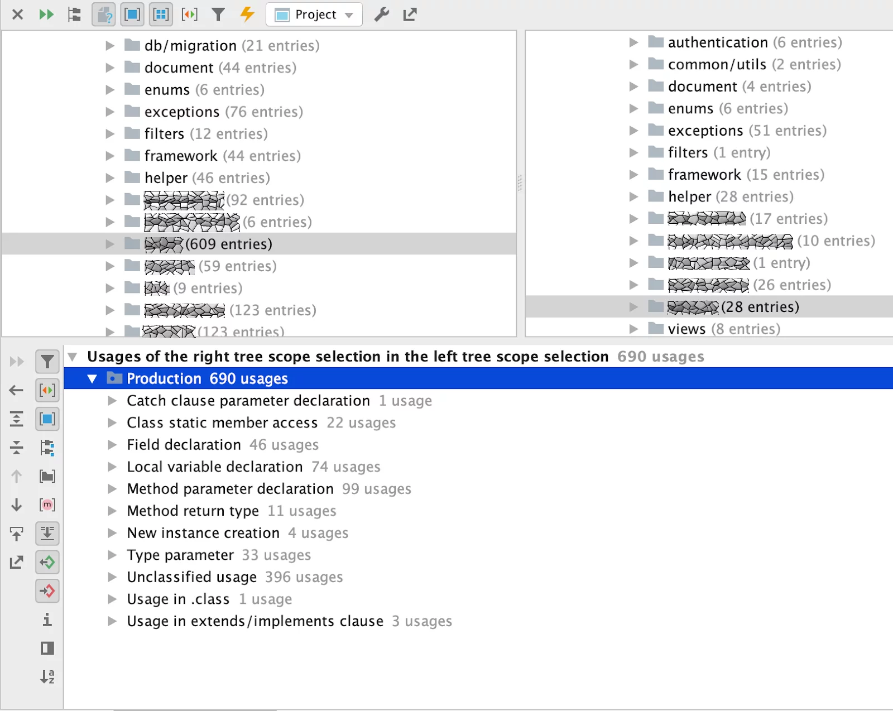

# 迭代开发中的微服务拆分

## **前言**

领域驱动设计（DDD）的普及和应用让微服务拆分和落地有了理论

的指导，有章可循，有法可依。特别是在一个产品或者项目开发的初期，可以很自然的通过DDD的知识帮助进行微服务的划分，指导架构设计。而在项目迭代开发过程中，架构已经稳定，业务需求源源不断，将已有服务进行拆分的场景并不多见，能参考的案例也并不多，思考其原因可能有以下两个方面：

- **存在即合理，拆分需要足够的理由**：已有架构可以满足当前的业务需求，服务拆分会产生很多工作量，拆分能带来哪些收益，会解决哪些问题，需要经过慎重的思考，不能为了拆分而拆分
- **业务优先级通常更高，拆分时机很难选择**：产品在持续演进，迭代开发在持续的进行，服务拆分工作繁杂，很难在一个跌代里全部完成，一方面有限的资源要优先保证业务需求正常上线，另一方面拆分工作和业务开发同时进行，既要保证业务的稳定也要顺利推进拆分工作，拆分时机并不太好把握

本文就根据笔者经历的迭代开发过程中的微服务拆分实践，来聊聊微服务拆分的必要性、时机选择和具体的操作过程。

## **拆分的必要性**

说到拆分已有服务，相信一定有人会问，怎么识别出来服务需要拆分的？非拆不可吗？拆分能带来什么价值？

服务拆分出发点一定是为了解决项目开发过程中的痛点问题，而不是仅仅从服务划分的合理性上来看，特别是在产品已经相对稳定，新的需求不断开发过程中。通常，我们可以从以下几个方面来思考拆分服务的必要性：

#### **第一、解耦业务，降低上下文理解难度，追求更合理的产品设计**

多个业务概念耦合在一起，特别是架构上耦合比较紧密时，会产生一些不好的涌现物。业务代码在一起，数据存储在一起，实现层面可以很方便的查询或更新相关联的数据，这很容易产生实现驱动设计。以我们拆分的服务既有功能举个例子：库存零售上报日期既可以在订单上维护，也可以在库存上维护，直观的感觉这个业务概念的归属不清晰。可以看到， 底层架构设计从某种程度上影响了上层的业务设计。

当产品开发周期较长，业务人员和开发人员不断更替，让项目上每个成员都具备完整的业务知识变的越来越难，在快速交付迭代过程中，追求业务价值和实现的简便通常在不断的取平衡，不合理的底层架构让这个天平产生了倾斜，为了低成本的完成某些产品功能导致了一些不合理的设计，逐渐产生的不合理设计从一定程度上增加了业务的复杂度，为产品后续的演进埋下了隐患，往往后面需要花费更多的成本来为这些隐患买单。

#### **第二、降低系统复杂度，提升开发效率**

当代码量达到一定量级，这种业务耦合带来的上下文传递的复杂度会非常高，新上项目的同学需要消化理解的内容太多，很难快速上手，某种程度上降低了团队的效率。

另外，敏捷软件开发过程中，通常开发人员要写单元测试来保证代码的正确性，开发人员每次提交前需要在本地运行所有的测试，保证修改没有影响到既有的功能，而产品代码体量的增长会伴随着测试代码量的增长，本地执行测试的时间会越来越长，开发人员得到反馈的时间变长，在团队规模较大的情况下，反馈周期变长无疑会降低整个团队的开发效率。

#### **第三、提升项目整体质量**

在日常开发中，每个功能都有很多种实现方式，不同的选择会产生不同的影响，给开发人员带来较大的挑战是如何能够在复杂的业务逻辑面前能够找到一个合适的实现方式，这需要开发人员对业务流程和价值有非常清晰的理解；但在实践中，特别是项目开发人员不断更替的情况下，这点是非常难做到的。

另外，业务概念生命周期不同会导致业务需求变化速率也不同，这也对产品质量产生了非常大的挑战。我们在每个迭代都会做BUG分析，最多的BUG类型是新代码破坏原有功能，我们尝试增加测试覆盖率已解决已有功能破坏的问题，但收效甚微，主要原因是业务复杂，一方面因为写更具业务价值的测试成本也非常高，成本很高，更重要的是很难将所有的组合场景都测全。

## **拆分的想法验证**

当拆分的理由已经足够，在开始实施之前，非常有必要用理论工具对服务的拆分想法进行验证，**一方面**可以理清现有服务包含的业务领域以及不同业务领域之间的关系，进一步验证服务拆分的必要性，**另一方面**可以理清不同业务上下文的边界，为后续的拆分工作提供依据。

### 事件工作坊

很自然可以想到，事件工作坊（Event Storming Workshop）可以用来验证我们的拆分想法。通过事件工作坊，我们可以产出当前服务的上下文映射（Context Mapping），从中我们很容易看到当前服务承载了哪些业务领域的逻辑，也可以清晰看到每个领域的边界以及上下游关系，如下图示例： 

### **梳理数据表识别领域概念**

限界上下文映射指明了服务拆分的方向，但对于一些比较细小的业务概念，通常很难全部覆盖。通常来讲，服务所涉及的业务概念最终都会落地到存储设备上，我们通过对服务的数据表的梳理来找到全部的业务概念并匹配到对应的业务上下文。

梳理工作需要对数据表结构非常熟悉的开发同学，以及对业务关系比较熟悉的同学一起来完成，这个步骤的产出如下：

**第一，数据表和业务概念关系图**

这个图的结果和我们事件风暴产生的上下文应该是可以对应上的，用以指导后面服务拆分后的数据库拆分工作。

**第二，不合理的数据表设计或数据关系设计**

大部分业务实现基本上最终都可以归结为对数据的增删改查，单纯满足实现而忽略业务合理性的逻辑是造成逻辑复杂且难以维护的重要原因。结合业务的理解，对当前数据表设计的合理性重新做一次评估，识别出其中不合理的业务概念划分和数据关系，这有助于解决拆分过程中难以处理的查询或数据更新逻辑。

## **拆分的时机选择**

要真正开始实施拆分服务，还需要找到合适的时机，**一方面**，产品在不断的演进，开发工作也是每个迭代在持续的进行，必须保证拆分工作不影响日常的业务功能开发；**另一方面**，拆分服务本身工作量很大，每个服务都有自己的特殊性，没有一套通用的方案可以直接实施，需要在一步一步的拆分中仔细分析，找到下一步的关键问题并针对解决，这不是一个短期的工作，准确说没有办法在一个迭代周期内完成，所以必须保证拆分的工作可以随着迭代的发布周期同步上线，且不影响业务功能。落地时机的选择可以参考以下几种场景：

#### **业务即将发生较大调整或演进时**

考虑到拆分必要性和成本，如果业务基本不再变化，即便现在的服务有诸多问题，但运行稳定，拆分服务并没有太大的收益，所以时机上要选择业务演进仍在持续发生，且即将发生较大调整之前，原因在于基于当前的架构增加越多的业务逻辑，产生的耦合可能越大，未来拆分需要考虑的内容越多，难度就越大。这里的“较大调整”包括但不限于以下场景：

- 在服务的核心领域上做比较大规模的调整，比如重新调整业务流程进而适配市场变化
- 对服务的某个领域做大规模的增强以支持更多的需求，该领域的业务体量增大很多
- 新增的系统集成，使架构上的依赖关系混乱

#### **服务核心业务变化频率较低时**

在产品迭代开发过程中实施拆分和新功能开发之间会存在一定的冲突。拆分工作一旦开始，对于新功能开发，有**两种选择，一种**是在拆分后基于新的架构进行，**一种**先按照原来的方式开发，再由负责拆分的同学把功能进行迁移，但具体采用什么策略，需要针对具体的问题具体分析，这样的功能越多，给拆分带来的额外工作量也越多。

考虑到落地实施的难度，拆分工作要选择核心业务变化比较小的阶段进行，这样可以尽量避免产生重复的工作，拆分的推进也会更加顺利。

## **拆分的原则**

讨论完微服务拆分的必要性，也找到了合适的拆分时机，紧跟着一个巨大的挑战就是如何把服务拆分付诸实践，这项工作非常繁杂，实操中总会有些意想不到的事情需要处理，即使大家已经自认为对服务非常熟悉（通常也恰恰是因为大家自认为对服务已经非常熟悉，所以依据自己的认知往往会忽略了很多的细节）。

服务拆分可以理解为在架构层面做一次重构，我们需要为此次重构设置一些原则，当我们在遇到一些比较难处理的问题时，用以指导我们该如何做出决定。这些原则不是仅仅针对这一次重构，也应该是整个架构设计的一些原则：

- 定义上下游关系，下游系统可以直接依赖上游系统，反之则不可
- 上游系统的行为对下游系统产生影响需要通过领域事件的方式来实现
- 一次更新操作不能同时操作两个以上的聚合
- 针对前端的数据适配放到BFF（Backend for frontend）层处理，服务只返回属于自己业务上下文的数据

## **拆分的具体步骤**

### **1. 调整代码结构，分析模块间依赖**

在理清业务边界以及数据表和服务的归属关系后，回到物理代码上，相信大家还是一头雾水，原因是之前的设计前提是数据资源归属于当前服务，每个实现都可能会用到任何数据，这带来几个需要解决的问题：

- 一个聚合的代码直接访问另一个聚合的代码或数据表
- 单元测试代码混杂在一起
- 跨聚合查询的SQL语句

为了能够进一步指导后面的拆分工作，首先我们必须理清现状，也就是对于以上几个问题进行梳理并给出解决方案，我们的做法如下：

- 根据业务上下文划分将代码分别放在在不同的目录（package）下-
- 通过工具（如Intellij的Analyze Dependencies）分析package之间的依赖，如下图：

- 分析代码中的SQL语句，找到跨聚合查询的SQL

### **2. 添加测试保护**

找到了改进的方向，在开始之前，为了保证后续工作的安全和正确，首先要检查是否有足够的测试来保护我们的改动，对于改动的内容影响到的接口，我们要检查的方向有两个：

- 如果缺少契约测试，需要根据前端或其他服务的调用需求来补全契约测试，已保证修改后不会影响到和前端或其他服务之间的集成契约
- 如果缺少接口级别的测试，建议至少增加一个覆盖接口成功主流程的测试，保证修改后的功能是正确的。如果有返回信息，需要在测试中校验每一个返回参数的正确性

### **3. 消除业务代码依赖**

根据第1步分析出来的结果，我们可以开始消除业务代码之间的依赖，针对不同的场景，有以下几种方法：

- 不同领域同时依赖一个工具类，独立出来，最后可以复制到两个服务中
- 迁移实现位置错误的代码到正确的package中
- 直接访问另一个聚合数据表的，改为访问聚合的接口（不存在已有接口的新建接口）
- 数据库实体嵌套通过调用聚合的接口实现

经过以上操作之后，除单元测试代码和跨聚合查询的SQL，业务代码基本上做到仅有接口级别的依赖，这部分接口依赖可能存在以下两个问题：

- 上游系统依赖下游系统的接口，需要分析是否上游系统的业务概念中有缺失信息
- 下游系统通过接口实现数据库实体嵌套，需要分析下游系统是否需要保存这么多上游系统的信息

为了避免以上不合理的接口级别依赖造成理解上的问题，可以增加一些中立的代码（这部分代码最终会放到BFF层）来统一处理这层依赖。

### **4. 分离单元测试代码**

单元测试代码的分离可按单元测试粒度的不同可以分为两部分

**第一部分是函数级别的单元测试**，这部分基本没有影响，只需要迁移到对应的目录下即可。

**第二部分是使用内存数据库的接口级别的测试**，这部分比较麻烦，从准备测试数据的角度来看，之前的测试会直接按数据表来准备数据，现在由于不同的表会分给不同的服务，准备数据的操作会变成一部分在数据表中，一部分通过Mock另一个服务接口的方式实现；这部分的测试通常比较重，很多测试数据的准备会散落在不同的测试中，基本上大部分的测试都需要修改，建议实际操作过程中能够按照业务场景封装一些工具类，修改起来会更高效。

### **5. 跨聚合SQL查询和信息冗余处理**

跨聚合的SQL查询通常是在业务上有几种情况：

- **情况一**，从业务含义理解，某些字段属于另外一个领域，只是由于数据表建模的问题，需要根据业务实际情况进行调整
- **情况二**，某些字段属于另一个领域模型，这些字段通常代表着领域模型的一些核心特征，且基本不变，很多场景下在当前领域的查询业务中作为查询条件也很合理（比如：通过一个车辆的车架号还搜索车辆的销售订单信息），对于这类信息，可以冗余在当前服务中
- **情况三**，类似情况二，但这类信息的字段可能会经常发生改变，针对这种场景，建议重新审视之前业务场景的实现是否合理，是否有必要把当前领域的一些关键信息和其他领域的不稳定信息作为联合查询条件，通过适当的调整业务来适配服务拆分带来的影响。

### **6. 服务拆分，跨服务接口上升到BFF，引入Toggle**

经过以上的努力，业务实现还是在一个物理服务中，接口也没有发生实际的改变，只是增加了内建的BFFService用来适配。下一步就是从物理上将两个服务拆分开，做法可以参考以下步骤：

- 保持现有服务的接口和代码不变
- 新建服务，将上游系统的代码拆分到新服务中
- 将之前填加的中立代码上升到BFF
- 在BFF层引入Toggle，通过Toggle来控制访问原有服务接口，还是通过BFF访问新服务的接口

Toggle的引入是为了保证拆分过程的过渡平稳，如果有问题可以及时的切回原有的实现方式。

### **7. 拆分数据库**

当服务拆分为两个并运行稳定后，就可以把数据库拆分成两个，这个做法会有很多种，比较简单的办法是根据当前数据库复制一个拷贝出来，并且实时的做数据同步，数据库切换时修改新建服务的配置，指向新建数据库即可，运行稳定后删除两个数据库中多余的数据表。

## 总结

微服务拆分是微服务架构绕不过的话题，项目初期的服务划分取决于能够获取到的业务知识，以及对项目长期定位的理解，只能尽量保证在已有知识的情况下做到相对合理，随着业务的变化，架构仍需要不断演进，以满足市场以及业务的变化。

因此，在项目迭代开发过程中做微服务的拆分有的时候变的非常必要，但也不能盲目只追求服务划分的合理性，当拆分能够解决项目的一些痛点问题时，服务的拆分才具备必要性。

另外，服务拆分也要选择合适的时机，好的时机可以帮我们更好的应对未来的变化，同时也可以帮我们节省一些不必要的工作。这要求我们在日常开发过程中，经常关注我们服务的合理性和未来的需求对服务的影响，尽量权衡各种利益，找到一个相对平衡的时机。

微服务拆分工作繁琐而复杂，这不仅仅是一项技术层面的重构，这项工作需要对业务有非常深刻的理解，在服务拆分之前我们一定要理清业务现状，并制定好拆分的基本原则，以指导解决拆分过程中产生的问题。