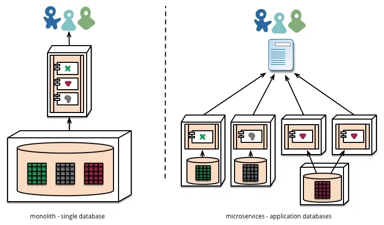

# 为什么每个微服务要有自己独立的数据库？

实施微服务架构，我们一直在遵循一个实践原则：每个微服务要有自己独立的数据库，避免数据库层面的耦合。这种理所当然感觉好像不需要多加思考，就是应该这样做。

图片来源：James Lewis和Martin Fowler的文章《Microservices》

那么到底为什么每个微服务都需要独立的数据库，数据放在一个数据库有问题吗？要回答这个问题，我们还是要回归到微服务的定义 （参见James Lewis和Martin Fowler的文章[《Microservices》](https://martinfowler.com/articles/microservices.html)）：

> In short, the microservice architectural style is an approach to developing a single application as a suite of small services, each running in its own process and communicating with lightweight mechanisms, often an HTTP resource API. These services are built around business capabilities and independently deployable by fully automated deployment machinery. There is a bare minimum of centralized management of these services, which may be written in different programming languages and use different data storage technologies.

这个定义中指明了微服务架构风格的典型特征，如：技术异构（每个服务可以采用不同的编程语言或不同的数据存储技术）、独立部署和围绕业务能力构建，等等。

为了回答为什么每个微服务要有自己独立的数据库这个问题，我们可以从微服务架构风格的几个典型特征入手，看看独立数据库可以带来哪些好处，或者共享数据库会带来哪些问题。

------

### 微服务支持技术异构

为了更好的解决特殊场景的问题，微服务架构并不提倡使用适合所有场景的标准化技术，而是针对每个服务的特点，选择更合适的技术。

这个技术不仅包括编程语言、技术框架，当然也包括数据存储技术；纽曼(Sam Newman)在《微服务设计》一书中举了一个例子很好的解释了数据存储技术异构带来的好处：

> 对于社交网络来说，图数据库能够更好的处理用户之间的交互操作，但对于用户发布的帖子而言，文档数据库可能是一个更好的选择

图片来源：《微服务设计》第1章图1-1

技术异构很自然让我们为每个微服务选择了独立的数据库，但杠精附体的同学可能紧接着会问：那如果服务不需要采用异构的技术，那是不是就可以使用同一个数据库了呢，比如都使用MySQL数据库？

------

### 微服务是自治的

微服务是小而自治的，自治性的一个非常重要的特性就是独立部署，一个服务的修改和部署不应该对其他服务产生影响，但如果多个服务共享数据库，在数据库层的耦合让不确定性变大，一个服务对数据库结构的变更很有可能影响其他服务，即破坏了自治性。

自治性的好处体现在整个系统的弹性上，当一个服务发生故障时，不会造成整个系统的不可用。然而，如果多个服务共享数据库，数据库的异常会导致多个服务同时故障，也就大大增加了整个系统不可用的概率。

自治性还体现在服务的可扩展性上，不同的服务因业务不同其需要满足的性能和并发量要求也不同。当请求量增加时只需要对部分服务进行扩展，而不是所有服务；同样当数据库性能无法满足需求时，只需要对部分服务的数据库进行扩容升级，而如果多个服务共享数据库，扩容升级的影响就会作用到多个服务，一方面破坏了服务的自治性，另一方面当其他服务对数据库没有那么高要求时，资源是浪费的。

继续杠精附体，那是不是可以把并发量和性能要求相近的业务合并为一个服务，而共享同一个数据库呢？

------

### 微服务是围绕业务能力构建的

这个问题其实是微服务架构实施落地的一个非常热点问题：如何划分微服务？

划分微服务要遵循高内聚、低耦合这个原则的，这也是微服务架构优势所在；《领域驱动设计》引入了限界上下文（bounded context）的概念，通过对业务的梳理找到不同业务上下文之间的边界，帮助我们找到了划分微服务的方法，这里的重点在业务边界。James Lewis和Martin Fowler在微服务的定义中也强调微服务是构建在业务能力之上的，可见微服务的小而自治是建立在独立的业务能力基础之上的。

因此，简单的将并发量和性能要求相近的业务合并到一个服务中，无法达到微服务期望的效果，也就没法获得微服务所具有的好处。不同的业务对数据库的要求除了要考虑并发量和性能，还应该包括数据量的大小、读写的比例、实时性要求等等，共享数据库的方式一般情况下也很难满足不同业务服务对这些指标的要求，将所有服务的数据都存放在一个数据库中本身也是一种非常大的挑战。

------

### 微服务架构要不断演进

微服务架构风格还有一个非常重要的特征，就是支持架构的演进；不论是互联网企业，还是在数字化转型过程中的传统企业，市场的变化和不确定性是不可避免的，当接到一个新的需求，需要用新的技术手段来解决，微服务架构就体现出了独特的优势，在不对其他服务产生影响的情况下，可以随意变更一个服务内部的技术框架或数据存储技术，共享数据库明显做不到这一点。

------

### 最后

以上通过分析微服务架构风格的典型特征，我们尝试回答了为什么每个微服务要有一个独立数据库，每个服务拥有独立数据库和其他微服务架构提倡的实践一起，共同完成了微服务架构风格所具备的优点。

每个服务拥有独立数据库并不是只有优点，数据的分散管理给数据一致性带来了很大的挑战，考虑到分布式事务的高昂代价和实现成本，微服务提倡服务之间的无事务协调，通过最终一致性来保证业务流程的正常推进。