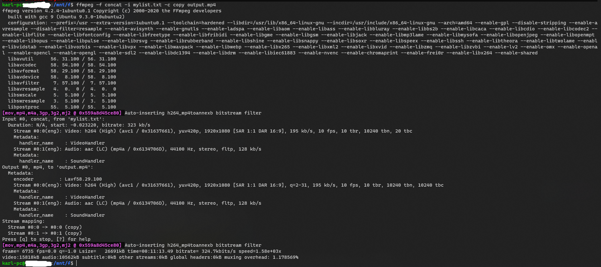

## 安装 ffmpeg
```Shell
sudo apt-get update
sudo apt install ffmpeg
```

## 转码 convert wmv to mp4
```shell
sudo ffmpeg -i v1.wmv -qscale:v 1 v1.mp4
sudo ffmpeg -i v2.wmv -qscale:v 1 v2.mp4
```

其他转码示例：
```shell
ffmpeg -i out.ogv -vcodec h264 out.mp4
ffmpeg -i out.ogv -vcodec mpeg4 out.mp4
ffmpeg -i out.ogv -vcodec libxvid out.mp4
ffmpeg -i out.mp4 -vcodec wmv1 out.wmv
ffmpeg -i out.mp4 -vcodec wmv2 out.wmv
```
-i 后面是输入文件名。-vcodec 后面是编码格式，h264 最佳，但 Windows 系统默认不安装。如果是要插入 ppt 的视频，选择 wmv1 或 wmv2 基本上万无一失。
附加选项：-r 指定帧率，-s 指定分辨率，-b 指定比特率；于此同时可以对声道进行转码，-acodec 指定音频编码，-ab 指定音频比特率，-ac 指定声道数，例如
```shell
ffmpeg -i out.ogv -s 640x480 -b 500k -vcodec h264 -r 29.97 -acodec libfaac -ab 48k -ac 2 out.mp4
```

## 剪切 
用 -ss 和 -t 选项， 从第 30 秒开始，向后截取 10 秒的视频，并保存：
```shell
ffmpeg -i input.wmv -ss 00:00:30.0 -c copy -t 00:00:10.0 output.wmv
ffmpeg -i input.wmv -ss 30 -c copy -t 10 output.wmv
```
达成相同效果，也可以用 -ss 和 -to 选项， 从第 30 秒截取到第 40 秒:
```shell
ffmpeg -i input.wmv -ss 30 -c copy -to 40 output.wmv
```
值得注意的是，ffmpeg 为了加速，会使用关键帧技术， 所以有时剪切出来的结果在起止时间上未必准确。 通常来说，把 -ss 选项放在 -i 之前，会使用关键帧技术； 把 -ss 选项放在 -i 之后，则不使用关键帧技术。 如果要使用关键帧技术又要保留时间戳，可以加上 -copyts 选项:
```shell
ffmpeg -ss 00:01:00 -i video.mp4 -to 00:02:00 -c copy -copyts cut.mp4
```
参考：[ffmpeg.org](https://trac.ffmpeg.org/wiki/Seeking)


## 合并 concat vedio
把多个视频合并成一个视频，这里简单的使用 contact demuxer:
```shell
sudo vim mylist.txt
file 'v1.mp4'
file 'v2.mp4'

ffmpeg -f concat -i mylist.txt -c copy output.mp4
```



参考：

[stackoverflow](https://ffmpeg.org/faq.html#How-can-I-join-video-files_003f)

[ffmpeg.org](https://stackoverflow.com/questions/7333232/how-to-concatenate-two-mp4-files-using-ffmpeg)


补充说明：

众所周知，从某些视频网站下载的视频是分段的。比如新浪视频每隔6分钟分段，俗称“ 6分钟诅咒”。
现在的任务是将这些视频片段合并起来，并且尽量无损。
方法一：FFmpeg concat 协议
对于 MPEG 格式的视频，可以直接连接：
```shell
ffmpeg -i "concat:input1.mpg|input2.mpg|input3.mpg" -c copy output.mpg
```
对于非 MPEG 格式容器，但是是 MPEG 编码器（H.264、DivX、XviD、MPEG4、MPEG2、AAC、MP2、MP3 等），可以包装进 TS 格式的容器再合并。在新浪视频，有很多视频使用 H.264 编码器，可以采用这个方法
```shell
ffmpeg -i input1.flv -c copy -bsf:v h264_mp4toannexb -f mpegts input1.ts
ffmpeg -i input2.flv -c copy -bsf:v h264_mp4toannexb -f mpegts input2.ts
ffmpeg -i input3.flv -c copy -bsf:v h264_mp4toannexb -f mpegts input3.ts
ffmpeg -i "concat:input1.ts|input2.ts|input3.ts" -c copy -bsf:a aac_adtstoasc -movflags +faststart output.mp4
```
保存 QuickTime/MP4 格式容器的时候，建议加上  -movflags +faststart。这样分享文件给别人的时候可以边下边看。
方法二：FFmpeg concat 分离器
这种方法成功率很高，也是最好的，但是需要 FFmpeg 1.1 以上版本。先创建一个文本文件 filelist.txt：
```shell
file 'input1.mkv'
file 'input2.mkv'
file 'input3.mkv'
```
然后：
```shell
ffmpeg -f concat -i filelist.txt -c copy output.mkv
```
注意：使用 FFmpeg concat 分离器时，如果文件名有奇怪的字符，要在  filelist.txt 中转义。
方法三：Mencoder 连接文件并重建索引
这种方法只对很少的视频格式生效。幸运的是，新浪视频使用的 FLV 格式是可以这样连接的。对于没有使用 MPEG 编码器的视频（如 FLV1 编码器），可以尝试这种方法，或许能够成功。
```shell
mencoder -forceidx -of lavf -oac copy -ovc copy -o output.flv input1.flv input2.flv input3.flv
```
方法四：使用 FFmpeg concat 过滤器重新编码（有损）
语法有点复杂，但是其实不难。这个方法可以合并不同编码器的视频片段，也可以作为其他方法失效的后备措施。
```shell
ffmpeg -i input1.mp4 -i input2.webm -i input3.avi -filter_complex '[0:0] [0:1] [1:0] [1:1] [2:0] [2:1] concat=n=3:v=1:a=1 [v] [a]' -map '[v]' -map '[a]' <编码器选项> output.mkv
```
如你所见，上面的命令合并了三种不同格式的文件，FFmpeg concat 过滤器会重新编码它们。 注意这是有损压缩。
[0:0] [0:1] [1:0] [1:1] [2:0] [2:1] 分别表示第一个输入文件的视频、音频、第二个输入文件的视频、音频、第三个输入文件的视频、音频。 concat=n=3:v=1:a=1 表示有三个输入文件，输出一条视频流和一条音频流。 [v] [a] 就是得到的视频流和音频流的名字，注意在 bash 等 shell 中需要用引号，防止通配符扩展。
提示
以上三种方法，在可能的情况下，最好使用第二种。第一种次之，第三种更次。第四种是后备方案，尽量避免。
规格不同的视频合并后可能会有无法预测的结果。
有些媒体需要先分离视频和音频，合并完成后再封装回去。
对于 Packed B-Frames 的视频，如果封装成 MKV 格式的时候提示 Can't write packet with unknown timestamp，尝试在 FFmpeg 命令的 ffmpeg 后面加上 -fflags +genpts