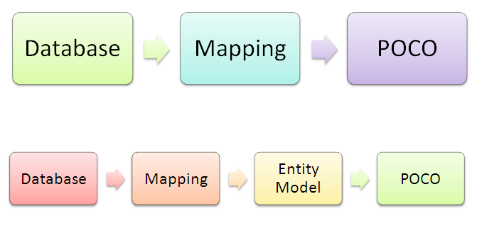

    POCO是指Plain Old Class Object，也就是最基本的CLR Class，在原先的EF中，实体类通常是从一个基类继承下来的，而且带有大量的属性描述。而POCO则是指最原始的Class，换句话说这个实体的 Class仅仅需要从Object继承即可，不需要从某一个特定的基类继承。主要是配合Code First使用。Cost Frist则是指我们先定义POCO这样的实体class，然后生成数据库。实际上现在也可以使用Entity Framework Power tools将已经存在的数据库反向生成POCO的class(不通过edmx文件)。
    
    以下是stackoverflow中的回答：
    
    Can someone define what exactly 'POCO' means? I am encountering the term more and more often, and I'm wondering if it is only about plain classes or it means something more?
    
    Answer:
    
    "Plain Old C# Object"
    
    Just a normal class, no attributes describing infrastructure concerns or other responsibilities that your domain objects shouldn't have.
    
    EDIT - as other answers have stated, it is technically "Plain Old CLR Object" but I, like David Arno comments, prefer "Plain Old Class Object" to avoid ties to specific languages or technologies.
    
    TO CLARIFY: In other words, they don’t derive from some special base class, nor do they return any special types for their properties.
    
    ============================
    
    Most people have said it - Plain Old CLR Object (as opposed to the earlier POJO - Plain Old Java Object)
    
    The POJO one came out of EJB, which required you to inherit from a specific parent class for things like value objects (what you get back from a query in an ORM or similar), so if you ever wanted to move from EJB (eg to Spring), you were stuffed.
    
    POJO's are just classes which dont force inheritance or any attribute markup to make them "work" in whatever framework you are using.
    
    POCO's are the same, except in .NET.
    
    Generally it'll be used around ORM's - older (and some current ones) require you to inherit from a specific base class, which ties you to that product. Newer ones dont (nhibernate being the variant I know) - you just make a class, register it with the ORM, and you are off. Much easier.

