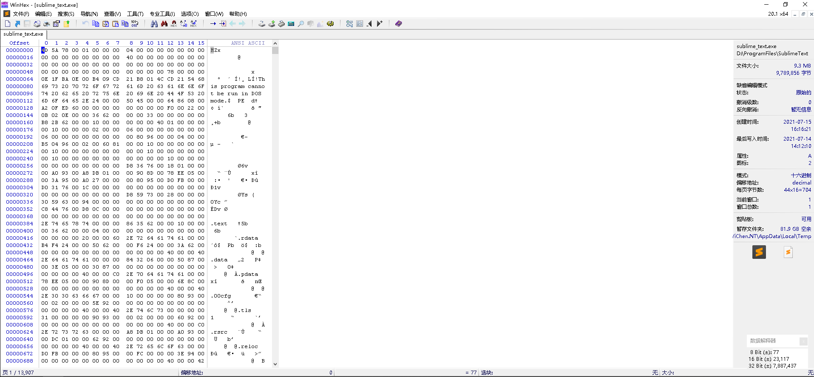
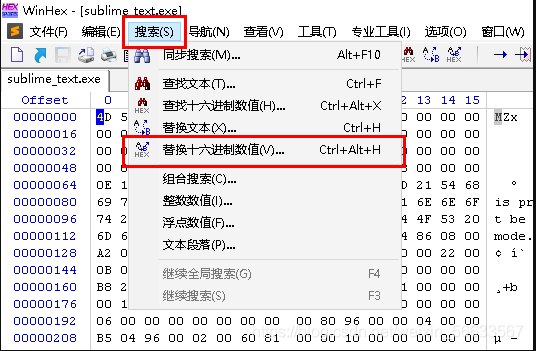
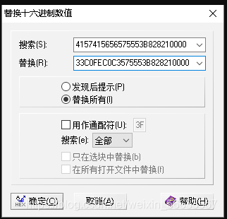
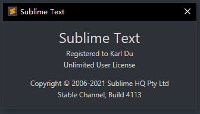

## 使用 WinHex

使用 WinHex 打开 Sublime Text 4 安装路径下的 sublime_text.exe



## 搜索/替换 16 进制数据





| 版本 | 搜索数据                   | 替换数据                   |
| ---- | -------------------------- | -------------------------- |
| x64  | 4157415656575553B828210000 | 33C0FEC0C3575553B828210000 |
| x86  | 55535756B8AC200000         | 33C0FEC0C3AC200000         |

替换系统 hosts 文件

| 搜索数据                                   | 替换数据                                   |
| ------------------------------------------ | ------------------------------------------ |
| 6C6963656E73652E7375626C696D6568712E636F6D | 7375626C696D6568712E6C6F63616C686F73740000 |

替换完毕后，使用秘钥进行注册

## 秘钥

```SQL
----- BEGIN LICENSE -----
Karl Du
Unlimited User License
EA7E-81044230
0C0CD4A8 CAA317D9 CCABD1AC 434C984C
7E4A0B13 77893C3E DD0A5BA1 B2EB721C
4BAAB4C4 9B96437D 14EB743E 7DB55D9C
7CA26EE2 67C3B4EC 29B2C65A 88D90C59
CB6CCBA5 7DE6177B C02C2826 8C9A21B0
6AB1A5B6 20B09EA2 01C979BD 29670B19
92DC6D90 6E365849 4AB84739 5B4C3EA1
048CC1D0 9748ED54 CAC9D585 90CAD815
------ END LICENSE ------
```


