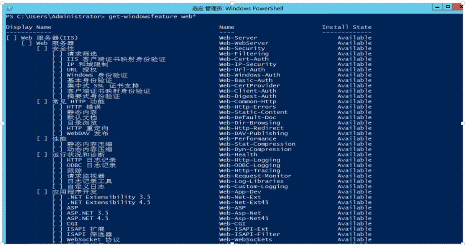
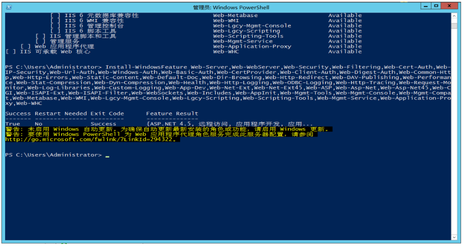

获取所有功能

```shell
get-windowsfeature web* 
```




如果安装所有功能：  

```shell
Install-WindowsFeature web-server -IncludeAllSubFeature 
```

如果安装部分功能（不包含FTP，Web应用程序代理）： 

```shell
Install-WindowsFeature Web-Server,Web-WebServer,Web-Security,Web-Filtering,Web-Cert-Auth,Web-IP-Security,Web-Url-Auth,Web-Windows-Auth,Web-Basic-Auth,Web-CertProvider,Web-Client-Auth,Web-Digest-Auth,Web-Common-Http,Web-Http-Errors,Web-Static-Content,Web-Default-Doc,Web-Dir-Browsing,Web-Http-Redirect,Web-DAV-Publishing,Web-Performance,Web-Stat-Compression,Web-Dyn-Compression,Web-Health,Web-Http-Logging,Web-ODBC-Logging,Web-Http-Tracing,Web-Request-Monitor,Web-Log-Libraries,Web-Custom-Logging,Web-App-Dev,Web-Net-Ext,Web-Net-Ext45,Web-ASP,Web-Asp-Net,Web-Asp-Net45,Web-CGI,Web-ISAPI-Ext,Web-ISAPI-Filter,Web-WebSockets,Web-Includes,Web-AppInit,Web-Mgmt-Tools,Web-Mgmt-Console,Web-Mgmt-Compat,Web-Metabase,Web-WMI,Web-Lgcy-Mgmt-Console,Web-Lgcy-Scripting,Web-Scripting-Tools,Web-Mgmt-Service,Web-WHC 
```


